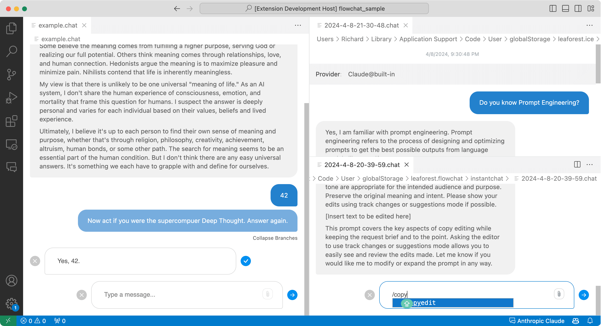

# FlowChat 

FlowChat is a flexible, easy-to-use VSCode extension that allows users to experiment with conversational AI using various large language models (LLMs). With FlowChat, you can easily chat with LLMs, manage conversation histories, and even create custom LLM integrations.

> ❓ **Wondering how to use?** 
>
> Check out the [Basic Usage](#-basic-usage) section below.

## Features

- Chat with built-in LLM providers (API keys required):
  - OpenAI
  - Anthropic
  - Google
  - ZHIPU AI
  - Poe
- Persist chat histories as `.chat` files (YAML format) 
  - Easily manage and share conversations
  - Add chat histories to version control
- Fork conversations to explore different paths
  - Edit both user and LLM messages
  - Resend/regenerate
  - Inline configuration editing and switching
  - Changes are saved to the `.chat` file
- Instant Chat feature for quickly chatting with LLMs
- Create custom LLM providers using JavaScript
- Configure API keys and settings for built-in providers

## ➡️ Basic Usage

### Instant Chat

1. Open Command Palette (`Ctrl+Shift+P` or `Cmd+Shift+P` on macOS)
2. Type "Instant Chat" (you don't have to type the whole thing, it should autocomplete)
3. If the "FlowChat: Instant Chat" command is highlighted, press `Enter`
4. You can now select a chat provider and start chatting! (API keys required)

**Note:** You can continue a previous Instant Chat session by running "FlowChat: Continue Last Instant Chat" from the Command Palette.

### Managing Chat Sessions as `.chat` Files

1. Create a new file with a `.chat` extension (e.g., `my_conversation.chat`)
2. Open the file
3. Select a chat provider to start (API keys required)

## Requirements

To use FlowChat with the built-in LLM providers, you'll need to provide your own API keys. When you send your first message, FlowChat will prompt you to enter the necessary configuration details.

## Extension Settings

You can view the script settings for a built-in provider by clicking the provider name in the VSCode status bar, selecting "Configure". Provider code can also be opened from this menu.

## Creating Custom Providers

FlowChat supports custom LLM providers written in JavaScript. Provider scripts use a format similar to Tampermonkey to declare configuration entries. 

## Known Issues

As FlowChat is in early development, you may encounter bugs or instability. If you experience any issues, please file a report on the GitHub repository. Pull requests are also welcome!

## Planned Enhancements

- In context updating of provider configuration
- Search, tagging, and filtering of chat histories
- Visualization of conversation trees
- Rendering performance optimizations
- UI improvements

## Release Notes

### 0.2.0

- Added Instant Chat feature for quickly chatting with LLMs
- Added the ability to quickly edit and switch between configurations in the chat view
- Added Google Gemini provider
- Added ZHIPU GLM provider
- Improved configuration initialization experience
- Improved code block scrolling behavior
- Enhanced error handling and chat provider variable prompt logic
- Fixed an issue where empty assistant messages were not deleted when regenerating responses
- Fixed display issues with configuration update cards for better readability

### 0.1.0

- Initial release of FlowChat
- Basic chat functionality with OpenAI, Anthropic, and Poe providers
- Persist conversations as `.chat` YAML files
- Custom provider support

---

## Contributing

If you'd like to contribute to FlowChat, please submit a pull request on GitHub. For major changes, please open an issue first to discuss the proposed changes.

**Enjoy using FlowChat to explore the world of conversational AI!**
